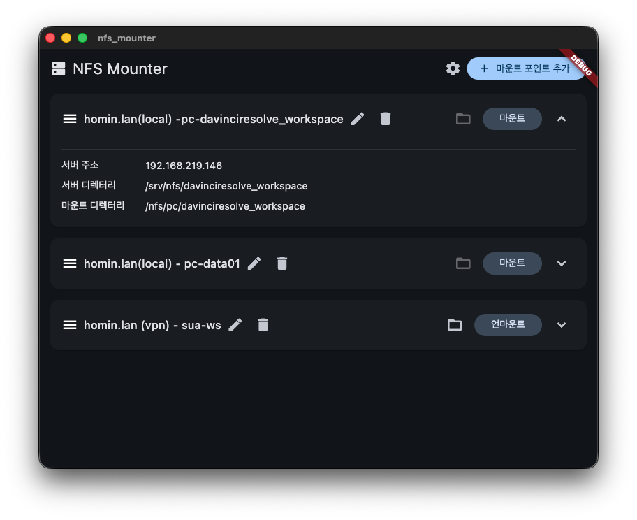

# NFS Mounter

macOS에서 NFS(Network File System) 디렉토리를 쉽게 마운트하고 관리할 수 있도록 도와주는 Flutter 기반 데스크톱 애플리케이션입니다.



## 주요 기능

- **GUI 기반 마운트 관리**: 명령줄을 사용하지 않고 직관적인 인터페이스로 NFS 서버를 마운트 및 언마운트할 수 있습니다.
- **마운트 지점 저장**: 설정한 마운트 지점(서버 주소, 경로 등)이 앱을 종료해도 저장되어 재실행 시 편리하게 사용할 수 있습니다.
- **마운트 지점 순서 변경**: 햄버거 메뉴 아이콘을 드래그하여 마운트 지점 목록의 순서를 자유롭게 변경할 수 있습니다.
- **다국어 지원**: 한국어(KO) 및 다국어 지원이 포함되어 있습니다.
- **생산성 향상**: 자주 사용하는 NFS 경로를 빠르게 연결하고 관리하세요.

## 시작하기

이 프로젝트는 macOS 애플리케이션으로 개발되었습니다. 실행하려면 Flutter SDK가 설치되어 있어야 합니다.

1. 저장소를 클론합니다.
2. 종속성을 설치합니다.
   ```bash
   flutter pub get
   ```
3. macOS 타겟으로 앱을 실행합니다.
   ```bash
   flutter run -d macos
   ```

## 요구 사항

- macOS
- NFS 서버 접근 권한

## 라이선스

이 프로젝트는 [MIT License](LICENSE) 하에 배포됩니다.
